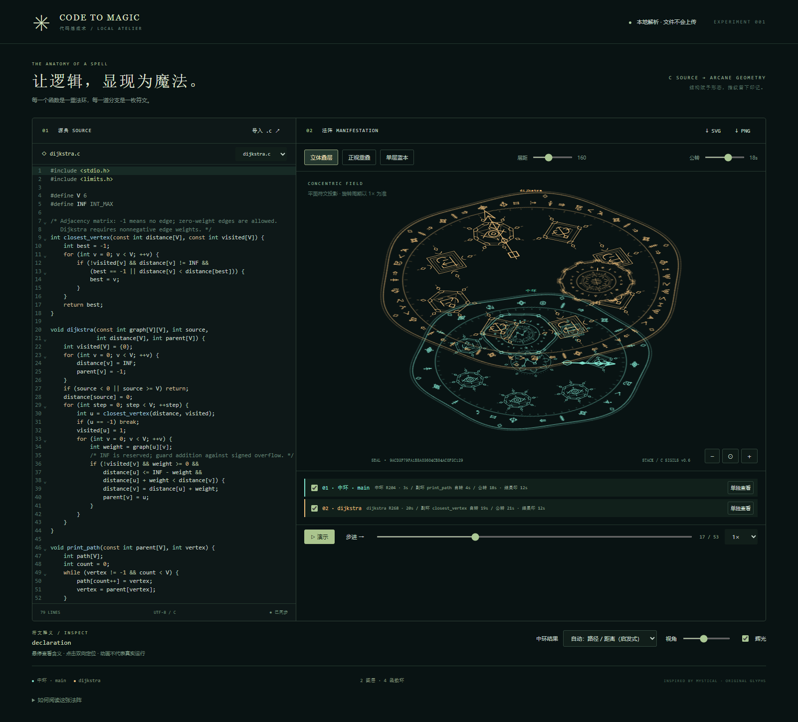

# Code to Magic · 代码炼成术

将单个 C 或 Python 文件转换成具有细线符文、发光动画和 2.5D 同心叠层的魔法阵。源码在浏览器内处理，不上传、不编译或执行。

这是一个本地优先的交互式可视化实验：它把源码的结构、调用关系和启发式结果类型映射成可读的符文图形，而不是把源码编码成需要反向解码的二维码。C 与 Python 共用符文、布局、分层、结果印、旋转和播放规则。每次导入都会得到确定性的布局，同一份源码在相同设置下可以复现同一幅魔法阵。

## 预览

默认示例是 Dijkstra 最短路算法。下面的静态图展示立体叠层和三种常驻魔法指针；网页内还可以旋转、暂停、逐步播放和切换图层。



静态导出示例： [立体叠层 SVG](outputs/dijkstra-stack.svg) · [正视图 SVG](outputs/dijkstra-front.svg) · [主层 SVG](outputs/dijkstra-single.svg)

## 启动

快捷入口：双击根目录的 `启动魔法阵.cmd`，自动启动本地服务并在默认浏览器打开；已有服务会直接复用。`打开网页.url` 仅打开默认地址，适用于服务已运行时。启动失败会保留提示窗口；日志在 `.runtime/`。入口不会联网安装依赖，也不会修改系统执行策略（仅启动进程临时设置）。

需要 Node.js 22 或更新版本。首次准备依赖或手动启动，可在本目录运行：

```powershell
npm install
npm run dev
```

打开终端显示的本地地址。也可使用 pnpm。首次安装需要联网，构建后的应用资源（包括解析器 WASM）均为本地资源。

```powershell
npm run build
npm test
```

## 使用

- 导入或拖入 UTF-8 编码的 `.c` / `.py` 文件，或选择自带示例，源码可直接编辑。后缀自动选择解析器和编辑器高亮；直接粘贴代码时可在「源码语言」中切换，不会替换当前文本。
- 默认展示 Dijkstra 最短路示例。函数形成彩色透视叠层；悬停符文查看含义，点击定位源码，源码光标反向定位符文。
- 在「立体叠层 / 正视重叠 / 单层蓝本」间切换。图层面板支持隐藏与单独查看，显示各半径旋转周期；调整层距、倾角、缩放和辉光。
- 点击演示开始旋转；暂停冻结当前帧。单步或进度条控制静态结构遍历。导出可重播 SVG 或 1680×1460 PNG 静态快照。SVG 在普通图片查看器中显示导出时的画面，在本应用导入后可动态播放。
- 较大函数的连续普通语句聚合成方框，点击展开，底部按钮折叠。

## 快速体验

在 Windows 上可直接双击 [启动魔法阵.cmd](启动魔法阵.cmd)。它会复用已运行的本地服务，否则启动 Vite 并打开浏览器。也可以在服务已运行时双击 [打开网页.url](打开网页.url)。

典型的本地开发流程：

```powershell
npm install
npm run dev
```

另开终端执行：

```powershell
npm run build       # TypeScript 检查并生成 dist/
npm test            # Vitest 单元测试
```

浏览器回归测试需要 Python、Playwright 和 Chrome；完整的导出与交互测试脚本位于 `tests/`。

## 项目结构

```text
src/                 解析、布局、SVG 场景、播放轨迹和编辑器
examples/            C 算法示例，以及 Python 圆周率计算 pi.py
tests/               算法样例校验、单元测试和浏览器回归测试
outputs/             已生成的 SVG/PNG 示例与导出说明
scripts/start.ps1    本地服务启动与端口复用脚本
```

应用不需要后端或数据库；tree-sitter WASM、解析和渲染均在浏览器本地完成。

## 映射与边界

解析器为固定版本的 web-tree-sitter 0.20.8 + tree-sitter-wasms 0.1.13 的 C / Python 语法（包内 Python grammar 基于 tree-sitter-python 0.21.0）。声明、分支、循环、调用、返回、结构体 / 类有独立图形。常见标准库函数按名称分为内存、I/O、文件、字符串和数学类别，属于启发式分类。实际支持的语法以打包的 grammar 为准，不承诺兼容所有最新 Python 语法。

从 `main`（不存在时为第一个函数）按源码结构遍历所有替代分支，循环只展示一次，递归不展开。纵深代表函数首次访问次序，而非真实执行时间；调用后的返回继续显示在原函数层。多次调用复用函数层。未访问函数变暗。宏、条件编译和 include 不展开；函数指针及跨文件目标不解析；不保证该文件可以通过 C 编译器。

原始 UTF-8 内容 SHA-256 控制装饰刻度；规范化结构哈希忽略注释及标识符拼写、保留标识符关系与操作符。排版只依赖结构和访问次序，所以格式或一致改名保持宏观几何稳定。名字和 API 分类仍随源码变化。结果印的自动类型使用函数名启发式，可能随改名改变；可手动选择类型。文件名不参与哈希。哈希碰撞概率极小，但图案不是无损编码，不保证每两份文件肉眼可区分。

Tree-sitter 的浏览器 API 使用 UTF-16 字符偏移，本项目源码联动与 CodeMirror 使用相同偏移，不将它误称为 UTF-8 字节位置。

输入限制 2 MB。语法错误显示诊断并尽可能保留局部图形。复杂结构可能仍然拥挤；所有分支节点优先保留。解析不代表真实运行，演示不同分支不表示它们会在一次执行中依次发生。

## 实现结构

- `src/analysis.ts`：C 解析、共享模型、入口 / 调用目标查询、规范化和诊断。
- `src/pythonAnalysis.ts`：Python 单文件解析、作用域 / 导入别名、结构归一化、返回类型提示。
- `src/parser.ts` / `src/source.ts`：共用 WASM 初始化、独立语法缓存和语言分发。
- `src/SceneV3.tsx`：主副环、自转/公转、分层投影、结果印与 SVG 图形。
- `src/playback.ts`：带调用栈的结构轨迹、调用挂起、返回与连续进度。
- `src/MagicHand.tsx`：结果类型驱动的异形时、分、秒指针。
- `src/compactLayout.ts` / `src/RingFrame.tsx`：自动紧凑半径与结果类型外轮廓。
- `src/ornaments.tsx`：按空白放大的重要节点徽章和装饰结果印。
- `scripts/start.ps1`：一键启动，检查端口、隐藏服务窗口、复用已运行服务。
- `src/Scene.tsx`：旧版渲染器及复用的节点聚合逻辑。
- `src/sigils.ts`：原创 C / Python 关键字及运算符线条符文；等价语义复用路径。
- `src/planes.ts`：函数归属、符文圆弧分配、半径安全间距、周期与结果类型规则。
- `src/main.tsx` / `src/Editor.tsx`：交互、源码联动、播放与导出。

视觉参考：[Denis M. Moskowitz 的 mystical_ps](https://github.com/denismm/mystical_ps)。本项目符文与实现独立编写，未复制其 PostScript 源码。

## 图层与周期

无分支、循环、goto 或内部函数调用，且不超过 12 个结构节点的函数归入同一简单函数层，不同函数用不同半径区分；其余函数中，不超过 18 个结构节点、少于唯一调用者节点数的 85%、且无内部调用的小型叶函数作为调用者的副环。递归、共享被调用函数、main 和全局声明不折入副环；每个函数只出现一次。这是可解释的视觉启发式，不是复杂度证明。

主副环周期分布在 3–20 秒（单层基础周期 12 秒），同层主副环周期差不超过 5 秒。只有中环（main）保留同心中心结果印，其他同心主环省略中心，副环保留自己的结果印；结果印为 12 秒周期，不受主副环周期差规则约束。周期均为 1× 播放速度下的值。隐藏图层不改变其他图层的颜色、位置或周期。正视图和单层图不使用倾斜或层间位移，立体视图为 2.5D 仿射投影，而非实体厚度建模。

主环使用实际 SVG 字形包围范围、可读字距、功能徽章与副环的空间需求自动求紧凑半径，节点圆弧按测量后的符文尺寸分配。外框按每个函数自身结果类型选择异形轮廓，main 在界面显示为“中环”。不同主环的符文带预留径向间隔；层距范围为 0–420，默认 160，不再被防重叠规则压缩。立体视图允许层间投影交叠，画布自动容纳纵深。重要控制/调用/返回节点按邻居间距、边界与中心结果印的空白放大，添加细线多边框、冠饰和卷曲端点，避免恢复跨圆暗实线。副环沿主环内侧公转，允许遮挡经过的功能徽章。原来的星形交叉暗线与功能节点连接实线已移除；调用虚线只在选择相应节点时显示，递归虚线保留。

内部功能节点：if 为菱形、for 为计数方形、while 为透镜形、do 为三角、switch 为六边形。中心结果类型可选路径/距离、数值、文本、集合、判定、未分类；自动模式仅根据函数名与 API 做启发式判断，不执行或证明算法，类型和统一周期会写入导出元数据。副环中心不显示函数名，而使用函数局部结果类别的装饰符印；类型仍是启发式，函数名保留在 SVG title 悬停说明及图层面板中。例如 closest_vertex 为数值印，print_path 为路径印。

副环公转与自转分开计算。公转滑块范围为 7–25 秒，默认基准 18 秒，不同副环相差 3 秒并限制到 25 秒；Dijkstra 示例为 18 秒和 21 秒。播放速度同样影响公转，暂停冻结自转、公转和中心结果印。PNG 保存当前相位的静态快照；新导出 SVG 同时保存当前画面和图形播放轨迹。

旋转方向使用 `code-features-v1`：将每个函数的返回类型文本、按源码顺序排列的节点类型、嵌套深度、API 类别、指针声明数量、关键字及运算符序列构成特征串。使用固定的 32 位散列及混合算法，以 `spin`、`orbit` 两个独立通道分别产生自转和公转方向（偶数顺时针，奇数逆时针）。方向不使用函数名、节点 ID、源码位置、半径、图层或调用者信息，主副环可同向或反向，自转与公转也可任意组合；不强制一张图内同时出现两种方向。相同特征保持相同方向，排版、注释和普通变量改名不影响方向；修改结构不保证一定翻向，因为方向只有两种。已知 API 类别或返回类型拼写变化可能影响方向。

中心结果印按结果类型另行生成方向，同类结果印方向一致，所有结果印仍使用 12 秒周期。符文顺序和表针在环内的推进方向随自转方向镜像，调用等待期间锁定同一符文并随环自转。新导出 SVG 保存实际有符号角速度；已有可重播 SVG 保持导出时的方向，不因规则升级而改变。

## Dijkstra 示例与验证

`examples/dijkstra.c` 使用邻接矩阵，时间复杂度 O(V²)，从顶点 0 出发的距离为 `0, 7, 9, 20, 20, 11`。权重必须非负，`-1` 表示无边，允许零权边；`INT_MAX` 保留为不可达哨兵，因此不表示等于或超出此值的距离。加法带溢出保护。

`outputs/dijkstra-stack.svg/png` 为立体叠层图，`dijkstra-front.svg/png` 为正视重叠图，`dijkstra-single.svg/png` 为 dijkstra 主层图（含 closest_vertex 副环）。main 主环携带 print_path 副环，dijkstra 主环携带 closest_vertex 副环。页面默认示例支持实时旋转。

`tests/dijkstra_test.c` 检查样例距离、前驱路径、零权边、不可达节点、溢出保护和非法源点。`tests/export_dijkstra.py` 检查图层、投影、隐藏、旋转暂停、简单函数合层并生成图片；浏览器测试依赖本机 Python Playwright 和 Chrome。

## 魔法指针播放

表针的当前步骤会同步高亮圆环上的符文及内层功能徽章，左侧编辑器自动高亮对应代码范围，运行高亮不触发页面或编辑器自动滚动；手动点击符文时仍可定位代码。亮金色表示当前步骤，较暗金色表示调用等待：进入子函数时，调用栈中的上层表针和调用处代码仍保留等待高亮；返回后解除等待。暂停、单步和拖动进度均保留当前状态，结束时保留最后一步。聚合符文会整体高亮，但代码侧只标出实际语句；自动高亮与点击产生的手动选中互相独立，不移动编辑光标，不更改源码。C、Python 使用同一套规则，这仍是结构演示，不表示真的执行了源码。

新导出的 SVG 带有不包含源码的高亮时间段，独立播放器的播放 / 暂停 / 拖动也会同步更新符文颜色，而不是固定在导出时高亮的步骤。旧 SVG 仍可播放原有轨迹，但不会自动补出缺失的高亮记录。`tests/execution_highlights.py` 验证代码 / 符文联动、调用等待、暂停、聚合、手动选择和 SVG 重播。

原来的运行圈选已取消。中环使用短时针，内部副环使用短秒针，独立分层函数使用中分针。三种表针全部常驻并采用相同运行规则：未调用时保持初始位置，执行时平滑推进，调用期间锁定符文并随环旋转，返回后保持最后一步，重新进入函数后继续演示；暂停时保持现场。

每个指针根据自己环的结果类型选择路径箭、刻度针、文本羽针、集合格针或判定菱针。这些是魔法阵中的指示图形，与 C 指针类型无关。

轨迹为静态结构演示：每条语句移动段为 0.72 个演示秒，外部调用或递归回路停留 0.38 秒；每帧平滑插值，播放倍率同时控制移动和停留时长。调用者的表针在圆环局部坐标中锁定调用符文，表针和该符文随圆环一起旋转；返回后表针平滑移向下一步。副环秒针也按同一规则处理外部调用等待。副环公转保持独立，秒针在自己的环内保持所指步骤。分支与循环仍按结构展示，不测量或模拟实际 C 执行耗时。

同一内部函数在不同调用位置会再次演示；递归回路不无限展开，调用深度上限 16、事件上限 6000。演示结束后停留在末帧，再次点击演示从头开始；进度条和单步可直接定位，连续播放不会闪现跳步。

项目仓库：[TimeThreeSecond/CodetoMagic](https://github.com/TimeThreeSecond/CodetoMagic)。

## SVG 独立动态播放

在工作台点击 `↓ SVG`，然后点击页首 `导入 SVG 动画 ↗`（也可拖入 SVG），即可进入独立播放器。支持播放、暂停、回到起点、拖动时间轴和 0.5× / 1× / 2× 调速。返回工作台保留原有源码。播放器保留导出时的视图、可见图层、符文聚合状态和时间相位，不重建代码，也不重新解析 C。

新 SVG 包含版本化 `code-to-magic-motion` 播放记录：总时长、导出时间、各旋转组的有符号角速度、副环轨道参数，以及各表针的起止角度和时间段。调用期间的空档自然形成等待。图形和轨迹均在文件内，未内嵌 JavaScript、C 源码或完整 AST；临时的选中调用连接线不写入播放记录。普通查看器仍会把它作为静态 SVG 显示，动画需要本项目播放器。旧版 SVG 没有足够的时间轨迹，需从 C 文件重新导出，不能凭空补回。

核心播放器 `src/svgPlayback.ts` 的 `readRecording()` 不依赖 React、Tree-sitter 或 C 模型，可连同 `src/playback.ts` 集成进其他 TypeScript 网页项目：

```ts
import { readRecording } from './svgPlayback';

const clip = readRecording(await file.text()); // file 为用户选择的 SVG File
container.replaceChildren(clip.svg);
clip.seek(0); // 任意秒数，自动限制在时长范围内
const start = performance.now();
let frame = 0;
function tick(now: number) {
  const seconds = Math.min(clip.data.duration, (now - start) / 1000);
  clip.seek(seconds);
  if (seconds < clip.data.duration) frame = requestAnimationFrame(tick);
}
frame = requestAnimationFrame(tick);
// 组件卸载时：cancelAnimationFrame(frame); clip.svg.remove();
```

导入上限 20 MB，轨迹最多 6000 段。导入时校验版本、时长与数值，并按 SVG 元素/属性白名单重建图形，丢弃脚本、事件属性、外部图片、样式和外部资源引用。不支持任意第三方 SVG 动画格式或编辑软件移除播放元数据后的文件。SVG 仍包含函数名称和图形结构，不适合作为源码匿名化工具。

`tests/svg_playback.py` 验证导出/导入姿态一致、双向旋转、独立播放、暂停与时间拖动，以及错误格式和主动内容过滤。

## Python 单文件适配

在示例下拉框选择 `pi.py` 即可体验，也可以导入自己的 `.py`。没有 Python 后端、没有调用系统 Python、不会安装导入文件声明的依赖。Python 代码与 C 一样经浏览器本地 Tree-sitter CST 解析后，归一化成共享的 `Model → Fn → Node`，进入同一个 `buildPlanes → compactRadius → SceneV3 → buildTimeline → recordSvg` 流程。不是让 AI 为每个文件定制法阵。

主要对应关系：

| Python 结构 | 共享视觉语法 |
| --- | --- |
| 赋值、解包、类型注解赋值、函数绑定 | 声明 / 绑定符文 |
| `if / elif / else`、条件表达式 | 条件分流及替代路径 |
| `for`、推导式迭代子句、`while` | 计数环 / 条件环 |
| `match / case` | C `switch / case` 的选择结构 |
| 函数调用、`return / break / continue` | 调用之眼、返回及循环控制符文 |
| `class`、方法、嵌套函数 | 数据结构符文、独立命名函数环 |
| `and / or / not`、`// / ** / :=` | 复用逻辑 / 除法 / 乘法 / 赋值路径，保留 Python 源词释义 |
| `try / except / finally / raise`、`with`、`async / await / yield` | 延伸同一线条符文语法；只展示结构，不模拟异常、资源或协程 |

存在顶层语句时，合成为「模块入口」中环，包括 `if __name__ == "__main__"` 中的调用；普通 `main()` 仍是一个可被调用的函数环。只有函数定义、没有顶层语句时，沿用 C 的回退规则，选择 `main` 或首个函数作为演示入口，不表示 Python 真正自动执行了它。中环保留唯一同心中心结果印；简单函数共面、小型单调用者叶函数作副环、递归及共享函数独立的判定与 C 相同。主副环自转 3–20 秒、同层差不超过 5 秒，副环公转 7–25 秒，中心结果印统一 12 秒；方向仍由节点种类、嵌套和运算数据决定。

本文件定义的普通函数、嵌套函数、明确的 `Class.method` 和类内 `self.method` / `cls.method` 可静态连接。参数和直接赋值的名称遮蔽会阻止误连；类方法使用限定名，推导式和 lambda 的局部名称不泄漏到外层。动态函数别名、返回函数、高阶调用、任意实例类型、继承派发、重绑定、装饰器改变调用目标等不做运行推断。装饰函数保留自己的函数环，但不展开装饰器；匿名函数只展示结构，不独立形成可解析调用目标的函数环。`global / nonlocal` 保留符文，不完整求解其跨作用域的数据流。类属性初始化、默认参数表达式和装饰器的真实执行顺序也不模拟。

`import / from ... import ... as ...` 保留为模块引用和导入信息；例如 `math.sqrt`、别名后的 `m.sqrt`、`from math import isqrt` 都可归入数学 API 特征，但不打开模块文件、不检查是否安装、不展开第三方库或跨文件调用。代码编辑器和符文定位统一使用 UTF-16 偏移，支持中文和 emoji。语法缺失 / ERROR 会提示行号、保留可解析部分；这不是完整 Python 编译检查，不能保证不存在未定义变量、类型错误或缩进语义错误。

结果类型保持 C 的启发式策略，同时接受 Python 返回注解：`int / float` → 数值，`bool` → 判定，`str` → 文本，`list / tuple / dict / set` → 集合；没有注解时只尝试直接返回字面值和简单字面值绑定。不能据此确定动态表达式的真正类型，也不验证注解是否正确。名称 / API 特征仍参与判断，无可靠依据时使用「未分类」，中环仍可手动覆盖。两种语言使用相同规则不等于相同算法会产生完全相同的魔法阵：语法树、类型信息、节点数量和源码指纹不同，几何与方向也可不同。

### 圆周率样例与验证

[`examples/pi.py`](examples/pi.py) 使用 Chudnovsky 级数 + 二分拆分，整数运算配合标准库 `math.isqrt`，无第三方依赖。默认计算圆周率小数点后 1000 位，截断而非四舍五入；可修改 `main()` 的 `DIGITS`。字符串按 9 位分块，避免为计算超过 4300 位而关闭 Python 的整数转字符串安全限制。

```powershell
python examples/pi.py
python tests/python_browser.py  # 先启动 npm run dev；需 Python Playwright 和 Chrome
```

测试以独立 Gauss–Legendre 算法核对 1、9、50、100、200、1000 位，并检查 5000 位输出长度与非法参数；浏览器测试覆盖真实 WASM、确定性、注释 / 改名、语法错误、Unicode 定位、模块入口、递归、作用域、导入别名、推导式、异常 / 异步、C 切换、动画、SVG / PNG 导出和 SVG 重播。`tests/python_production.py` 另验证 Vite 构建产物的 C / Python WASM 加载和导出重播（需先启动 5174 端口的 Vite preview）。导出示例为 [`outputs/pi-sigil.svg`](outputs/pi-sigil.svg) 和 [`outputs/pi-sigil.png`](outputs/pi-sigil.png)。SVG 播放记录仍不包含 Python 源码，不需要还原代码即可播放。

## 开源边界

本项目的符文、布局和交互实现为本仓库原创代码；视觉方向参考了 [mystical_ps](https://github.com/denismm/mystical_ps)，没有复制其 PostScript 源码。导入的 C / Python 文件只在当前浏览器标签页内解析，除非用户主动导出或提交，不会自动上传源码。当前仓库未附加许可证文件；如需在项目外再分发，请先补充合适的许可证。
