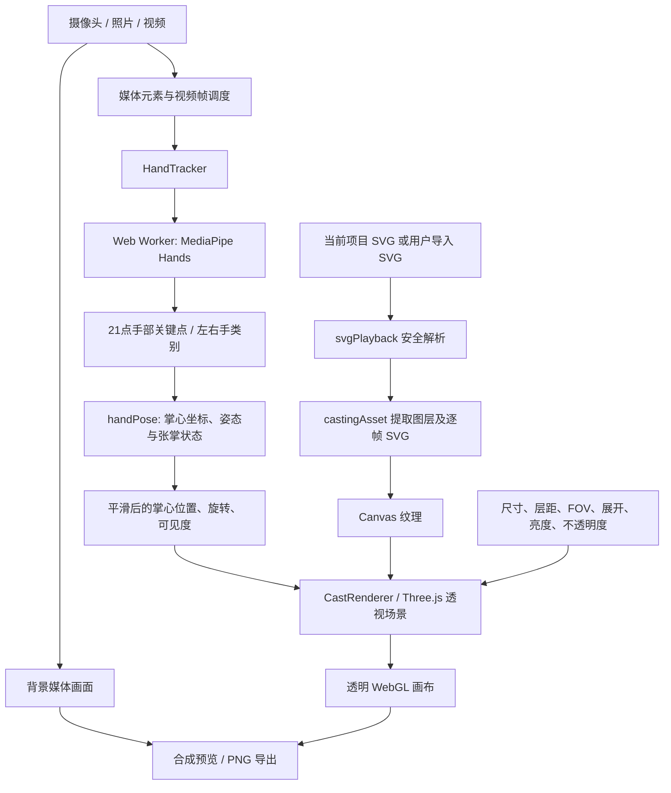

# Code to Magic：技术栈、实现路线与运行数据流

这份指南从代码入口一路追踪到 SVG 法阵、播放轨迹和掌前合成，适合第一次阅读仓库的人。文中描述的是当前实现，不把图形演示误称为真实代码执行，也不把启发式结果推断说成静态类型分析。

## 1. 项目做什么

Code to Magic 是一个纯前端的代码结构可视化应用。它把单个 C 或 Python 文件解析成统一的语法模型，再排成彩色同心符文环，支持源码与符文互相定位、结构轨迹播放、SVG/PNG 导出、SVG 动画回放，以及在摄像头、照片或视频前进行透视分层合成。

应用分三个页面，通过 Hash 路由切换：

| 页面 | 路由 | 工作 |
| --- | --- | --- |
| 代码炼成 | `#/forge` | 编辑/导入 C、Python，解析和生成符文法阵，查看结构播放，导出 SVG/PNG |
| 法阵播放 | `#/player` | 导入项目 SVG，播放其保存的几何动画和高亮轨迹 |
| 施法合成 | `#/cast` | 将分层 SVG 放到手掌前，以透视方式叠加媒体并导出 PNG |

用户代码、照片、视频和手部关键点均在浏览器本地处理；本项目没有应用后端、代码执行服务或数据库。

## 2. 技术栈

| 层次 | 技术 | 在项目中的职责 |
| --- | --- | --- |
| 语言与类型检查 | TypeScript、ES2022、严格类型检查 | 定义跨 C/Python 共用的数据模型和浏览器逻辑 |
| 界面 | React 19、React DOM | 页面、编辑器状态、路由页面和用户操作 |
| 开发/构建 | Vite 6、npm | 本地开发服务器、WASM 资源打包与生产构建 |
| 源码编辑 | CodeMirror 6、C++/Python language packages | 代码编辑、语法着色、选区/执行行高亮 |
| 语法解析 | `web-tree-sitter`、Tree-sitter C 与 Python WASM grammar | 在浏览器中将源码解析为 CST，提取语法节点、函数与源码位置 |
| 法阵绘制 | 原生 SVG | 绘制圆环、符文、函数徽章、旋转结构和运行指示针 |
| 3D 媒体合成 | Three.js、WebGL | 把各层 SVG 光栅化成透明纹理，在透视相机中放到掌前 |
| 手势识别 | MediaPipe Tasks Vision Hand Landmarker、Web Worker | 检测照片、视频帧或摄像头帧中的手部关键点，尽量避免识别工作阻塞界面 |
| 测试 | Vitest、Python Playwright、Chrome | 检查结构算法、浏览器交互、媒体输入与导出 |

Tree-sitter grammar 和 MediaPipe 模型均随项目/依赖本地提供，运行中的网页不依靠 CDN。摄像头通常要求 localhost 或 HTTPS，并需用户授权。

## 3. 目录与模块地图

```text
src/
  main.tsx             React 应用入口、页面导航、状态协调、SVG/PNG 导出入口
  Editor.tsx           CodeMirror 编辑器及源码选择/高亮联动
  parser.ts            Tree-sitter WASM 初始化与 C/Python parser 缓存
  source.ts            根据文件类型选择语言分析器
  analysis.ts          C CST → 统一函数/节点模型
  pythonAnalysis.ts    Python CST → 同一统一模型
  planes.ts            函数环分组、半径、图层、旋转周期与结果徽章分类
  compactLayout.ts     符文占宽估算与紧凑排布
  sigils.ts            语法节点、运算符、关键字到符文的映射
  ornaments.tsx        结果印、装饰环和函数视觉部件
  SceneV3.tsx          主 SVG 法阵场景和交互渲染
  playback.ts          由统一语法模型构造确定性结构播放轨迹
  execution.ts         播放时刻到源码/符文高亮状态的映射
  svgPlayback.ts       SVG 播放记录、时间定位与安全导入/导出
  SvgPlayer.tsx        独立 SVG 播放页面
  CastPage.tsx         照片/视频/摄像头、施法设置、PNG 合成交互
  HandTracker.ts       主线程与识别 Worker 通信、媒体帧管理
  hand.worker.ts       Worker 内初始化 MediaPipe 并执行检测
  handPose.ts          手掌坐标、姿态拟合、张掌状态与平滑
  castingAsset.ts      安全读取 SVG、提取图层并逐层生成纹理源
  CastRenderer.ts      Three.js 透视渲染、展开、透明度和亮度
  castingMath.ts       各层展开的连续动画曲线
  style.css            页面、编辑器、控件和媒体画布样式
examples/              C/Python 样例
outputs/               可直接查看的 SVG/PNG 样例
tests/                 Vitest 与浏览器自动化回归脚本
public/models/          本地 Hand Landmarker 模型及来源/哈希说明
docs/                   技术方案、阶段记录与本指南
```

入口由 `src/main.tsx` 协调；语言特定逻辑在解析和归一化阶段分开，其余排版、播放、SVG 输出共用模型。

## 4. 从源码到法阵：实现路线

### 4.1 输入和语言选择

用户可以编辑、粘贴、选择示例或导入一个 `.c` / `.py` 文件。文件扩展名决定解析器与编辑器语言；直接输入时也能切换语言。文件按 UTF-8 读取，当前源码导入限制为 2 MB。SVG 文件走独立播放器/法阵素材导入路径。

`source.ts` 选择 `analyzeCSource` 或 `analyzePythonSource`。`parser.ts` 只初始化一次 Tree-sitter WASM runtime，并分别缓存两种 grammar parser。Tree-sitter 返回 CST（具体语法树），其中包含标点、括号等语法构件；分析器把关心的结构抽取出来，而不是将整棵 CST 直接拿去绘图。

### 4.2 两种语法归一化为共同模型

C 和 Python 分析器各自产生相同概念的数据：

- `Model`：函数集合、入口、调用顺序、语法诊断、源码哈希和规范化语义哈希。
- `Fn`：函数 ID/名称、源码范围、函数内节点、顺序、可达状态和可选返回类型文本。
- `Node`：节点 ID/类型、显示标签、源码范围、嵌套深度、调用/API 类别、关键字/操作符符文以及可解析调用目标。
- `Range`：源码字符偏移和起止行，用于编辑器到符文的双向定位。

C 分析器抽取函数定义、声明、条件、循环、调用、返回等 CST 节点，并从声明中估算指针数量。Python 分析器为 Python 语法做单独映射，例如 `match/case`、推导式、`async/await`、异常结构和类/方法；其后同样输出 `Model → Fn → Node`，所以可复用共同的绘制、播放和导出逻辑。

调用解析是静态且保守的：C 根据单文件内函数名连接调用；Python 处理当前文件中可明确绑定的函数、嵌套函数、部分类方法和导入别名，同时避免将明显被参数遮蔽的同名变量误连。动态分派、高阶函数、跨文件调用等不保证解析。

分析器可能从函数返回注解、简单返回字面值和名称/API 特征推断展示用的结果徽章，例如数值、文本、集合、判定、路径或未知。这是视觉分类启发式，不是编译器类型推导；不能据此确定未知表达式运行时的真实类型。可手动选择结果类型覆盖自动结果。

### 4.3 统一模型变成几何和符文

`planes.ts` 根据函数体复杂度、控制流和调用关系决定哪些函数独立成层、哪些简单函数合面，以及哪些单一调用者的小型叶函数作为副环。递归或共享调用关系会影响合并条件，源节点应保留在相应主环/副环中。

`compactLayout.ts` 与 `planes.ts` 估算代码节点和符文需要的周向空间，选择半径并限制层距，以降低符文碰撞。`sigils.ts` 把 C/Python 节点类型、关键字和运算符映射为基础或组合符文；`ornaments.tsx` 和 `SceneV3.tsx` 把函数/调用结构、结果印、环带、节点标签与符文绘制成 SVG。颜色、半径、装饰和结果印共同表达结构。

自转/公转方向的确定性指纹来自函数返回类型文本以及节点类型、嵌套深度、API 类别、指针数量和符文 token 序列，再经固定哈希得到方向。它不代表程序数学意义上的行为，也不保证语义等价的所有程序得到同一个布局。环的半径和周期由独立排版规则决定。

### 4.4 结构播放与源码高亮

`playback.ts` 从入口函数沿已解析调用关系生成有限长度的演示时间线。当前语句按固定的演示时长移动，外部调用或递归回路以短暂停留表示；调用栈中的上层函数保留在调用位置。循环/分支按语法结构展示，不运行条件、不计算输入，也不执行用户源码。

播放时间经过 `samplePlayback()` 转成当前函数、节点、位置和时钟；`execution.ts` 把节点 ID 映射回原始源码范围。于是同一状态可以同步高亮左侧编辑器代码和 SVG 符文，并支持播放、暂停、逐步、进度定位。运行高亮是一条预设结构轨迹，不能当作真实程序运行结果或性能时间。

### 4.5 SVG 和 PNG 输出

代码炼成页直接导出当前 SVG 图形；SVG 文件还可附加版本化 `code-to-magic-motion` 记录，包含时长、旋转组和轨迹段，不包含完整源码。普通图片查看器显示静态画面，本项目的 `SvgPlayer` 读取记录后才可按时间播放。

SVG 导入使用受限解析/白名单重建，移除脚本、事件属性和外部资源引用；动画记录的版本、数值和长度有校验。普通 SVG 可以作为静态图形导入，但没有图层元数据的图不能还原为原始 C/Python 项目或多层动画。

PNG 由浏览器将当前 SVG 或 Three.js 画布绘制到 Canvas 后导出，因此是静态快照，不保留动画。施法 PNG 会将当前照片/视频帧和法阵合成到同尺寸画布；长边上限 4096 px。

## 5. 施法页面的数据流



1. `CastPage.tsx` 接收代码页序列化出的当前 SVG、播放器 SVG，或用户上传的 SVG；背景是摄像头、照片或视频。视频/摄像头按媒体帧更新检测，并将媒体时间用于同步法阵动画。
2. `HandTracker.ts` 控制 `hand.worker.ts`，尽量只保留最新帧，处理 Worker 回传的关键点。识别模型最多检测两只手，页面选择施法手并追踪其连续性。
3. `handPose.ts` 根据掌根及指根关键点建立掌面坐标，估计位置和朝向，计算手指张开状态，并用滤波/滞回减少姿态抖动。姿态结果是单目近似估计，不是精确距离测量。
4. `castingAsset.ts` 通过 `readRecording()` 安全解析 SVG；按 `[data-layer]` 拆成最多 64 个空间层，旧图退化为单层。每一层被单独序列化、光栅化为带透明度的 Canvas 纹理。
5. `CastRenderer.ts` 将纹理贴到平面网格。Three.js 透视相机用估计的掌心姿态定位整个法阵；图层沿掌面朝外方向按离掌距离和层距排列，并远到近排序透明层。
6. `castingMath.ts` 为每层计算延迟、缓动缩放和显现度，让阵图从小到大展开。用户控制的亮度通过材质颜色调整；不透明度单独增强纹理 alpha，同时受展开和追踪淡出的生命周期透明度约束。
7. WebGL 画布本身透明，叠到背景媒体上。导出时冻结当前媒体帧，使用同一组设置和渲染器生成 PNG，完成后恢复预览尺寸与状态。

透视相机的视场角、法阵大小、层距、位置和姿态都在同一个 Three.js 坐标系中计算，因此各层遵循一致的透视缩放。单目图像无法同时确定真实焦距、手掌实际尺寸和绝对深度；本项目以掌宽作为相对单位，通过投影和手动校正得到看起来一致的效果，不承诺厘米级精度。

## 6. 关键数据流速记

```text
C/Python 源码
  → Tree-sitter CST
  → 语言分析器归一化 Model / Fn / Node
  → planes 与 compactLayout 分层、半径、周向布局
  → sigils / ornaments / SceneV3 生成 SVG
  → playback 时间线驱动环、指针、符文高亮
  → SVG（可选播放元数据）/ Canvas PNG

法阵 SVG + 媒体
  → 安全读取 / 按 data-layer 拆图层
  → 透明纹理 + 手部姿态
  → Three.js 透视叠层与渐进展开
  → WebGL 预览 / 合成 PNG
```

## 7. 本地运行和学习顺序

先安装 Node.js/npm。首次准备依赖后，在仓库目录运行：

```powershell
npm install
npm run dev
```

开发服务器会输出本地地址。构建与单元测试命令：

```powershell
npm run build
npm test
```

Windows 用户也可以运行仓库根目录的 `启动魔法阵.cmd`。它会复用已运行的本地页面，或启动 Vite 并打开浏览器。自动浏览器测试还需要 Python、Playwright 和 Chrome；具体命令与素材参数可查看各 `tests/*_browser.py` 文件顶部说明。

建议按这条路径读代码：

1. `src/main.tsx`：看页面如何协调源码、SVG 和共享状态。
2. `src/source.ts`、`src/parser.ts`、`src/analysis.ts`：先读 C 解析与公共模型，再对照 `src/pythonAnalysis.ts`。
3. `src/planes.ts`、`src/compactLayout.ts`、`src/sigils.ts`、`src/SceneV3.tsx`：跟踪模型如何变成图形。
4. `src/playback.ts`、`src/execution.ts`、`src/svgPlayback.ts`：理解演示时间线、代码高亮和动态 SVG。
5. `src/CastPage.tsx`、`src/HandTracker.ts`、`src/handPose.ts`、`src/castingAsset.ts`、`src/CastRenderer.ts`：看媒体识别与空间合成。
6. 对照 `src/*.test.ts` 和 `tests/*_browser.py`，区分纯算法测试与需要真实浏览器/媒体的流程。

## 8. 能力边界

- 只分析单个 C 或 Python 源文件；不运行或编译代码，不载入其 include/import 文件，不做完整跨文件调用解析。
- 解析树能报告部分语法错误，但项目不是 C/Python 编译器、类型检查器或安全审计器。
- 调用关系、结果类别、几何和旋转方向依赖静态启发式；反射、动态分派、复杂别名和运行时数据可能无法确定。
- 播放轨迹用于解释抽取到的结构，不逐条执行源代码，分支选择与数值结果不代表实际运行。
- SVG 是图形/动画载体，不是源码备份；没有源码和足够元数据就无法还原原程序。播放器支持本项目约定的数据，不保证所有第三方 SVG 动画。
- 单目手部姿态只是掌宽尺度下的视觉估计；快速运动、遮挡或侧掌会影响识别。没有人物深度遮挡、厘米级校准和视频文件导出。
- 施法目前最多 64 层；GPU/纹理像素预算、设备摄像头权限和浏览器 WebGL 能力会影响画质及性能。

## 9. 延伸阅读

- [README 使用说明与功能概览](../README.md)
- [施法合成技术方案](施法合成技术方案.md)
- [施法实施进度与验证记录](施法实施进度.md)
- [模型来源与完整性信息](../public/models/README.md)
